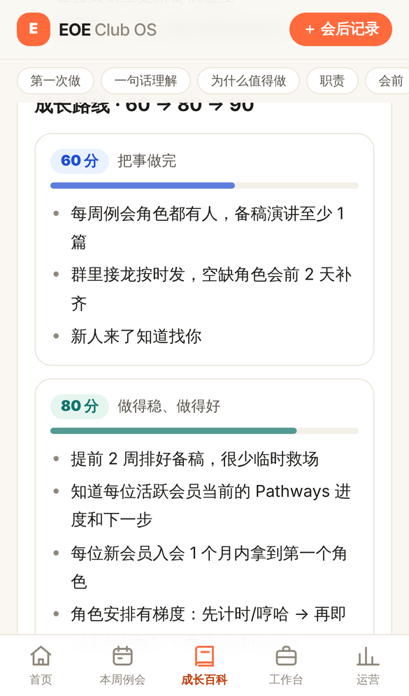
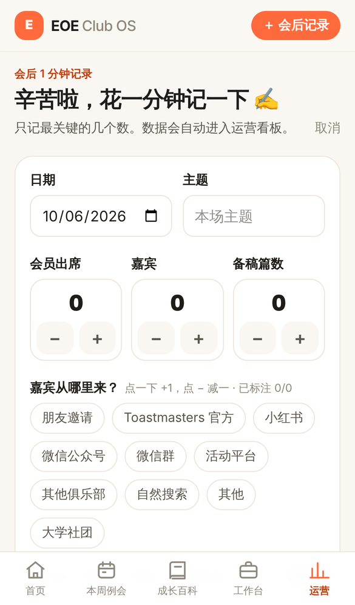
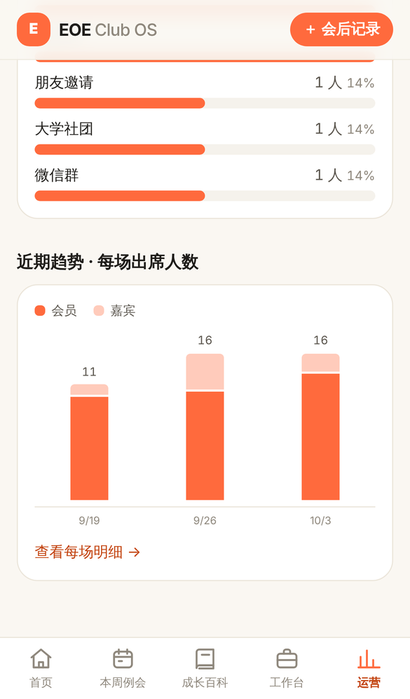

# EOE Club OS

EOE 中文演讲俱乐部内部使用的轻量 Web App。

> **减少俱乐部运营者的重复劳动，同时把组织经验沉淀下来。**
> 已经有成熟工具解决的问题（接龙、协作表格、投票、计时），不重复造轮子——EOE Club OS 是入口。

```
EOE Club OS
首页
├── 本周例会      这周的会单 / 腾讯文档 / 接龙 / 投票 / 角色，一个页面全找到
├── 成长百科 ★    EOE 成长百科（docs/eoe-growth-wiki/）：0–9 节、60/80/90 分、前人经验、可勾选清单、官员交接
├── 官员工作台 ★  每位官员：我的职责、本周/本月 checklist、模板、工具
├── 运营记录      会后 1 分钟记录（含嘉宾来源）
└── 运营看板      例会数、平均出席、累计嘉宾、嘉宾来源、近期趋势
```

<p>




</p>

当前版本：**v0.1**（见 [docs/ROADMAP.md](docs/ROADMAP.md)）

---

## 1. 五分钟启动

需要 Node.js 20+（推荐 22）。

```bash
git clone <本仓库地址>
cd <仓库目录>
npm install
npm run dev          # 打开 http://localhost:3000
```

不需要任何配置就能跑：数据默认写在本地文件 `data/local-db.json`（已被 `.gitignore` 忽略）。

常用命令：

| 命令 | 作用 |
|---|---|
| `npm run dev` | 本地开发（热更新） |
| `npm run build` | 生产构建（同时做 TypeScript 检查） |
| `npm run start` | 运行生产构建 |
| `npm run lint` | ESLint |

## 2. 改内容（不需要写代码）

所有内容在 [`content/`](content/README.md)：

| 想改什么 | 改哪里 |
|---|---|
| 成长百科：某个角色的指南（VPE、主持人…） | `docs/eoe-growth-wiki/content/officers/*.md`、`.../roles/*.md` |
| 成长百科：新增一个角色 | 往上面两个目录之一放一个 `.md`，按现有角色的 0–9 节结构写，**不用改代码** |
| 成长百科：EOE 现状 / 官员交接 / 资料来源 | `docs/eoe-growth-wiki/content/eoe-context.md`、`handover.md`、`research/SOURCES.md` |
| 成长百科卡片的图标和排序（可选） | `content/wiki-display.yaml` |
| 官员工作台 | `content/workbench/*.yaml` |
| 外部工具、投票模板、海报模板 | `content/tools.yaml` |
| 嘉宾来源选项 | `content/guest-sources.yaml` |

改完 → 提交到 GitHub → 重新部署即上线。可以直接在 GitHub 网页上编辑 Markdown。

成长百科的写作规则见 `docs/eoe-growth-wiki/` 里的说明（接入方案：[docs/plan-growth-wiki.md](docs/plan-growth-wiki.md)）。系统只负责显示，**不会改写正文**：
`【EOE 已确认 日期】` 显示成绿色徽章，`[V1]` 显示成可点开的来源标签，`（推论…）` 显示成推论标签，`- [ ]` 变成可勾选清单（勾选状态存在本机）。

**本周例会**和**会后记录**是在网站上直接填写的（存数据库），不需要改文件。

## 3. 部署

### 方案 A：Vercel + Supabase（推荐，免费额度够用）

1. 在 [Supabase](https://supabase.com) 新建项目 → SQL Editor → 执行 [`supabase/schema.sql`](supabase/schema.sql)。
2. 在 Vercel 导入本仓库，设置环境变量（见 `.env.example`）：
   - `SUPABASE_URL` = 项目 URL
   - `SUPABASE_SERVICE_ROLE_KEY` = service_role key（**只放在 Vercel 环境变量里，绝不提交到 Git**）
   - `EOE_WRITE_CODE`（可选）= 俱乐部口令，设置后写记录 / 改例会需要输入
3. 部署。之后每次 push 到主分支自动上线。

> 国内访问：Vercel 默认域名在国内可能不稳定，建议绑定自己的域名。也可以用方案 B 部署在国内云服务器。

### 方案 B：任意一台服务器（自带磁盘）

```bash
npm ci && npm run build
npm run start        # 默认 3000 端口，可用 PORT=8080 npm run start
```

不配 Supabase 时数据存在服务器的 `data/local-db.json`，记得定期备份这个文件。

## 4. 技术栈与结构

Next.js 16（App Router）+ TypeScript + Tailwind CSS v4，存储为 Supabase 或本地 JSON 二选一。没有状态管理库、没有后端服务、没有图表库。

```
content/            ← 全部内容（Markdown / YAML），见 content/README.md
src/app/            ← 页面（每个文件夹 = 一个网址）
  page.tsx            首页
  meeting/            本周例会（+ edit 编辑）
  wiki/               成长百科
  workbench/          官员工作台
  records/            运营记录（+ new 会后记录、[id] 详情）
  dashboard/          运营看板
  tools/              工具箱（外部工具 / 投票模板）
  actions.ts          所有写操作（Server Actions）
src/components/     ← 共用 UI
src/lib/
  types.ts            数据结构（改这里要同步 supabase/schema.sql）
  content.ts          成长百科加载器（docs/eoe-growth-wiki → 0–9 节）
  sources.ts          资料来源总表解析（research/SOURCES.md）
  wiki-remark.ts      可信度标记 / 来源标签 / 可勾选清单（只改显示，不改文字）
  config.ts           YAML 加载器（工具、工作台、嘉宾来源）
  store/              存储层：local.ts（JSON 文件）/ supabase.ts
  stats.ts            看板统计
supabase/schema.sql ← 数据库表结构
docs/               ← 产品、架构、路线图、Backlog
```

详细设计见 [docs/ARCHITECTURE.md](docs/ARCHITECTURE.md)。

## 5. 给接手的人 / AI 的说明

1. 先读 [docs/PRODUCT.md](docs/PRODUCT.md)（做什么、**不做什么**）和 [docs/ARCHITECTURE.md](docs/ARCHITECTURE.md)。
2. 新需求先看 [docs/BACKLOG.md](docs/BACKLOG.md)：很多功能是**有意不做**的。
3. 一级栏目只有五个，不要再加。
4. 内容进 `content/`，不要写死在 React 组件里。
5. 不要提交任何 Secret / Token / 密码（`.env*` 已被忽略，只有 `.env.example` 会提交）。
6. 改完至少跑一次 `npm run lint && npm run build`。
7. AI 编程助手请同时阅读 [AGENTS.md](AGENTS.md)。
